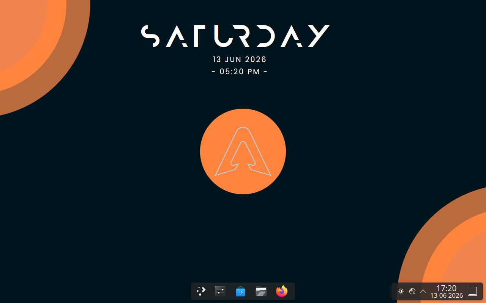

# ArqOS

ArqOS is an Arch Linux-based distribution focused on performance, simplicity, and user control while preserving the core Arch philosophy. The project aims to provide a lightweight and flexible system with sensible defaults, allowing users to build their environment according to their needs.



## Website

https://igi11111.github.io/ArqOS/

## Community

[](https://discord.gg/FgBBCnzdM)
---

## Features

* Arch Linux base with a rolling-release model
* Lightweight system design with minimal preinstalled software
* Customized installer based on the Linexin Installer project
* Full access to Pacman and the Arch User Repository (AUR)
* High level of customization and user control
* Up-to-date software packages directly from the Arch ecosystem

---

## Installer

ArqOS includes a customized version of the Linexin Installer, originally developed by Linexy.

The installer has been adapted specifically for ArqOS and includes:

* ArqOS-specific defaults and configuration
* Streamlined installation workflow
* Integrated branding and system setup improvements
* Adjustments designed to simplify deployment while maintaining flexibility

Credit for the original Linexin Installer belongs to Linexy. ArqOS does not claim ownership of the original project.

Original project:
https://github.com/Petexy/linexin-installer

---

## System Requirements

### Minimum Requirements

* 64-bit (x86_64) processor equivalent to Intel Core 2 Duo E6500 or newer
* 4 GB RAM
* 20 GB available disk space
* Internet connection during installation

### Recommended Requirements

* Dual-core or quad-core processor newer than Intel Core 2 Duo
* 8 GB RAM
* SSD storage
* Broadband internet connection

## Building ISO

```bash
sudo mkarchiso -v -r -w ./work -o ./out .     
```
in main directory (that with profiledef.sh)
ISO will appear in "out" directory

## Installation

1. Download or build the latest ArqOS ISO image.
2. Create a bootable USB drive.
3. Boot the target system from the USB device.
4. Launch the ArqOS Installer.
5. Follow the on-screen installation process.

---

## Intended Audience

ArqOS is designed for users who value control, customization, and a lightweight environment. While the installer simplifies deployment, basic Linux knowledge is recommended.

---

## Licensing

ArqOS follows the licenses of its upstream projects, including Arch Linux and the Linexin Installer. Please refer to the respective projects and individual software packages for detailed licensing information.

---

## Credits

* Arch Linux for the base system
* Linexy for the original Linexin Installer
* ArqOS contributors, testers, and community members
* Thanks for Dark who made wallpapers

---

## Contributing

Bug reports, feature requests, and pull requests are welcome through the project's GitHub repository.

---

## Contact

For support, development discussion, and community interaction, join the official Discord server or open an issue on GitHub.
